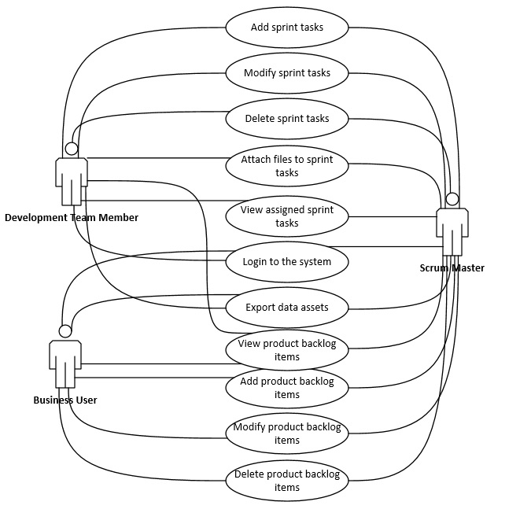
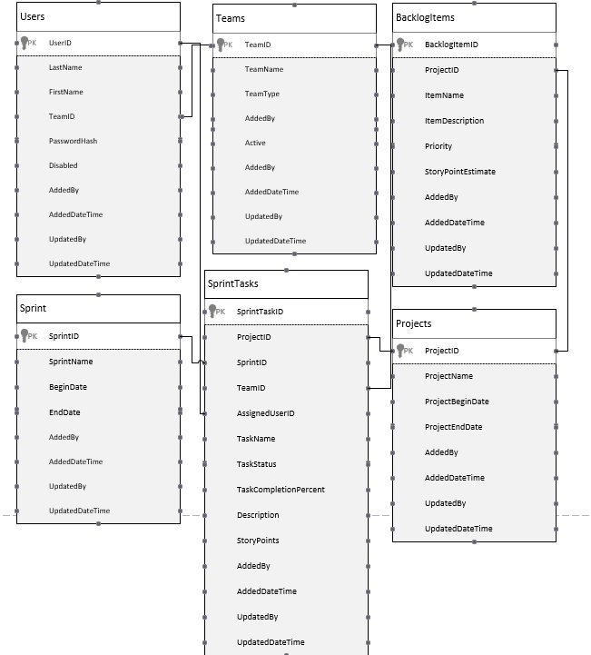
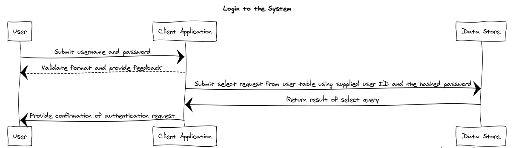
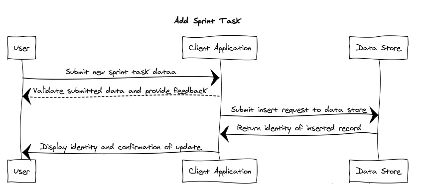

# **Scrum Project Tracking System**
Software Architecture Document
Version 1.0

### Revision History
|Date|Version|Description
|--|--|--|
|2/19/2019|1.0|Initial document release

### Table of Contents

1. Introduction
	 1.1 Purpose
	 1.2 Scope
	 1.3 Glossary of Terms/Reference
2. Architecture
    2.1 Overview
	2.1 Representation
	2.2 Constraints
3. Use-Case View
	3.1 Architecturally Significant Use Cases
4. Logical View
   4.1 Data Entities
   4.2 Use-Case Realizations
6. Process View
7. Deployment View

## 1. Introduction
### 1.1 Purpose
This evolving document serves as a comprehensive overview of the Scrum     Project Tracking System, including architectural, use-case, logical, process, and deployment views.  It will capture and document any significant ongoing changes to the architecture of the system.
	
### 1.2 Scope
This document serves as an architectural overview of the Scrum Project Tracking System, a Window application being designed by Indiana University Southeast students Scott Shrout and Matthew Swarens to support the project tracking needs of an organization engaging in scrum application development.

### 1.3 Glossary of Terms/References
Terms used in this document include:

**C#** - C Sharp - a general purpose object-oriented programming language used to develop web and desktop applications running on the .NET Framework.
https://docs.microsoft.com/en-us/dotnet/csharp/getting-started/introduction-to-the-csharp-language-and-the-net-framework
**.NET Framework** - a software framework developed by Microsoft to support application development primarily for the Microsoft Windows operating system.
https://docs.microsoft.com/en-us/dotnet/framework/get-started/overview
**Winforms**  - Windows Forms, a class library included in the .NET Framework used    in the development of graphic user interfaces (GUIs) for the Microsoft Windows operating system.
https://docs.microsoft.com/en-us/dotnet/framework/winforms/
**Entity Framework** - an object-relational mapping framework used in .NET applications to allow for database access.
**SQL** - Structured Query Language - a standard language used for various relationship database management systems that allows for the retrieval and modification of database assets.
http://www.sqlcourse.com/intro.html
**SQL Server** - Microsoft SQL Server - a relational database management system (RDBMS) developed by Microsoft; commonly used in small to enterprise level applications.
https://www.microsoft.com/en-us/sql-server/default.aspx

## 2. Architecture
### 2.1 Overview
The Scrum Project Tracking System is an application intended to allow an organization using scrum application development processes to track the deliverables associated with development sprints.  

This application uses a client-server architecture in which the client application contains the business logic and user interface elements used in modifying assets stored on database and file servers.  It is intended for multi-user, controlled access use by development and business teams.
### 2.2 Representation
The architecture of the application is examined within this document using the following views:

 - **Use-Case View** - documents the use cases for the system along with associated actors
 - **Logical View** - documents the architecturally significant data entities, use case realizations, and overall system design.
 - **Process View** - documents significant processes involved in the execution of the application along with their interactions
 - **Deployment View** - documents the various physical components involved in deployment and maintenance of the system

## 3. Use-Case View
### 3.1 Architecturally Significant Use Cases
####  1. Login to the System
##### Description:
This use case allows a user the ability to authenticate for access to the multi-user client-server system
##### Actors
Development team members, scrum masters, business team members, unauthorized users
#### 2. View Assigned Sprint Tasks
##### Description
This use case allows a user the ability to view the development tasks associated with a specific user or team, sprint, and project
##### Actors
Development team members, scrum masters 
#### 3. Add Sprint Tasks
##### Description
This use case allows a user to add new sprint tasks associated with a specific user or team, sprint, and project
##### Actors
Development team members, scrum masters
#### 4. Modify Sprint Tasks
##### Description
This use case allows a user the ability to modify an existing sprint task 
##### Actors
Development team members, scrum masters
#### 5. Attach Files to Sprint Tasks
##### Description
This use case allows a user the attach files to an existing sprint task 
##### Actors
Development team members, scrum masters
#### 4. Delete Sprint Tasks
##### Description
This use case allows a user the ability to delete an existing sprint task 
##### Actors
Development team members, scrum masters
#### 5. View Items on Product Backlog
##### Description
This use allows a user to view an existing backlog item associated with a specific project
##### Actors
Development team members, scrum masters, business team members
#### 5. Add Items to Product Backlog
##### Description
This use allows a user to add a new backlog item associated with a specific project
##### Actors
Scrum masters, business team members
#### 6. Modify Product Backlog Items
##### Description
This use allows a user to modify backlog items associated with a specific project
##### Actors
Scrum masters, business team members
#### 7. Delete Product Backlog Items
##### Description
This use allows a user to modify backlog items associated with a specific project
##### Actors
Scrum masters, business team members
#### 8. Export Data Assets
##### Description
This use allows a user to export backlog item and sprint task data to Excel spreadsheet or PDF format.
##### Actors
Development team members, scrum masters, business team members

## 4. Logical View
### 4.1 Data Entities

### 4.2 Use Case Realizations
#### Login to the System

#### Add Sprint Task

Additional use case realizations TBD

## 6. Process View
TBD

## 7. Deployment View
TBD

